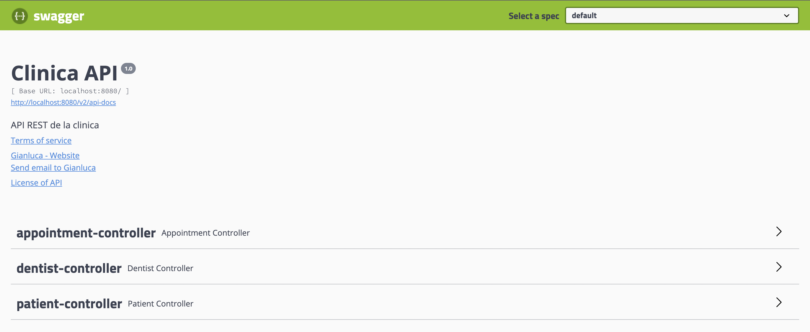

# Final Project BackEnd-1 ApiREST

## How does it work?

You can use the endpoints behind `http://localhost:8080/`.

Actually, much better if you just start the application and navigate to `http://localhost:8080/swagger-ui.html`. There you'll find a nice API documentation thanks to Swagger. Moreover, *you can play with it*.

